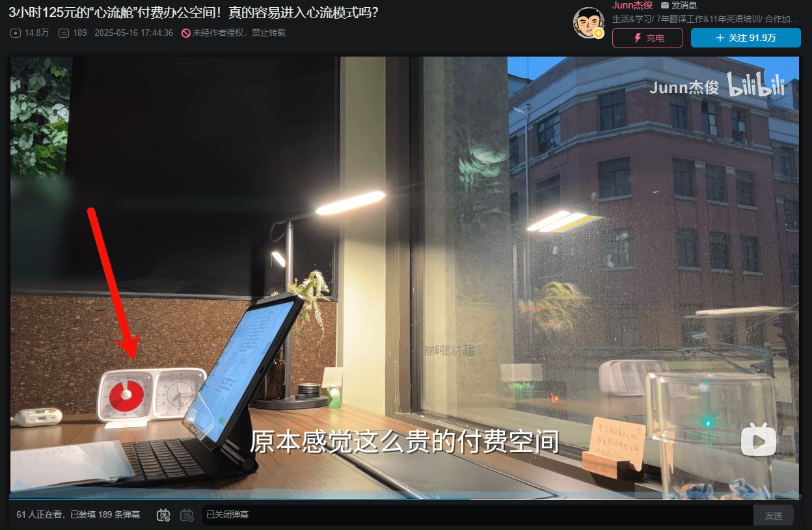
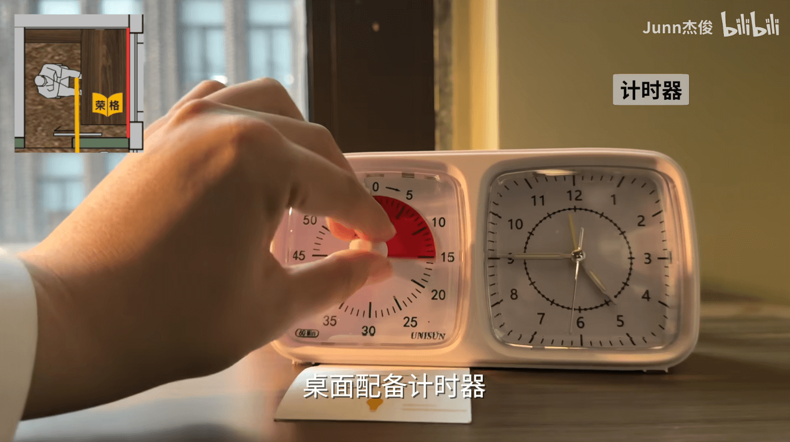
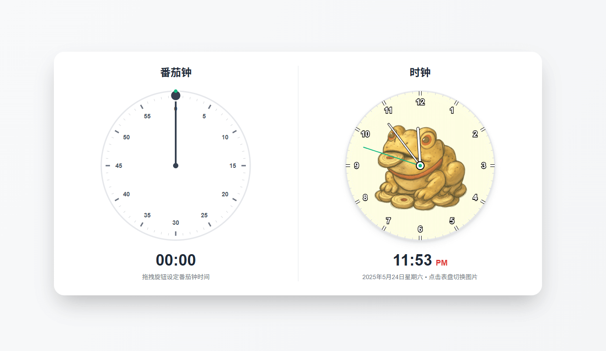

## 番茄钟时钟甜蜜双排

本项目源自zhaoolee 在bilibili 查看 [3小时125元的“心流舱”付费办公空间](https://www.bilibili.com/video/BV1GCEtzYETz) 里面桌子上有个很有趣的时钟，左半部分是番茄钟，右半部分是正常的时钟。

我个人感觉这个时钟确实很有趣，既让人专注当下，又能让人关注到整体的时间。

于是我用Cursor花费一小时写了个初版，然后把表盘换成了趋吉避凶的吉祥物，这样的小软件，用小屏幕显示，摆放到桌面上还能实现趋吉避凶的效果。

番茄钟时钟甜蜜双排，左侧番茄钟，右侧时钟，可以同时使用

体验地址：https://zhaoolee.com/DualTime/